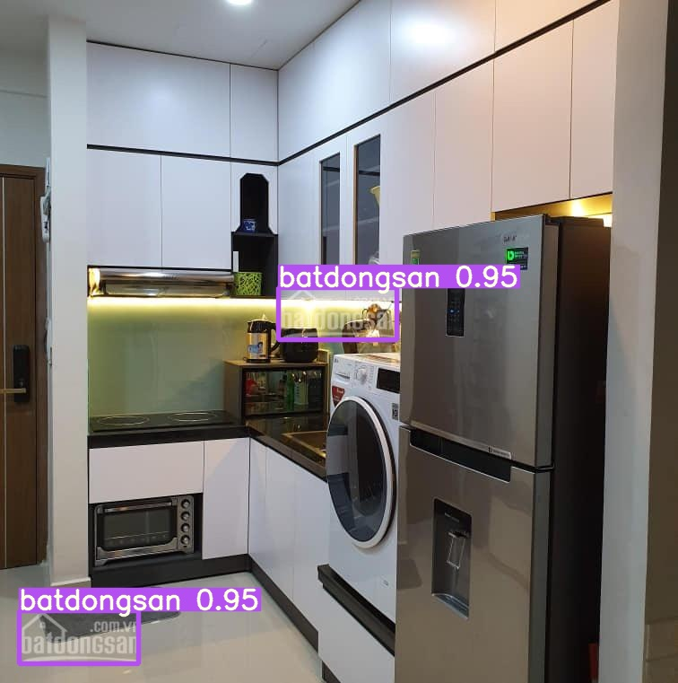

# Official YOLOv7

``` bash
Implementation of paper - [YOLOv7: Trainable bag-of-freebies sets new state-of-the-art for real-time object detectors](https://arxiv.org/abs/2207.02696)

Author's github page https://github.com/WongKinYiu/yolov7
```

---
## NOTE
``` bash
Following the instruction or got pain
```
---

## Installation

``` bash
 # Install virtualenv library
pip install virtualenv
 # Create virtual environment
python3.8 -m virtualenv yolov7_env
 # Activate virtual environment
source yolov7_env/bin/activate
 # Install required libraries to the created virtual environment
pip install -r requirements.txt
```
## Setup training data

``` bash
1. Your data must be organizated like following
root_dir
├── train
│       ├── images
│       │   ├── train_image_id_1.jpg
│       │   ├── train_image_id_2.jpg
│       │   ├── ...
│       │   
│       ├── labels
│           ├── train_image_id_1.txt
│           ├── train_image_id_2.txt
│           ├── ...
├── valid
        ├── images
        │   ├── valid_image_id_1.jpg
        │   ├── valid_image_id_2.jpg
        │   ├── ...
        │   
        ├── labels
            ├── valid_image_id_1.txt
            ├── valid_image_id_2.txt
            ├── ...
The label file contain bounding boxes in respectivate image in format 
        [label_id x_center y_center width height]
Note that the bounding boxes are norminated
2. Change the number classes in config file cfg/training/yolov7*.yaml
        nc: 4  # number of classes
3. In the dataset config file data/custom.yaml, modify like following example
    -----------------------------------------------------------------------------
    train: /disk_local/vypham/dataset/watermark/dataset_un_wm_muaban/train/images 
    val: /disk_local/vypham/dataset/watermark/dataset_un_wm_muaban/valid/images 
    nc: 4
    names: ['batdongsan', 'chotot', 'rever', 'muaban']
    -----------------------------------------------------------------------------
4. All dataset and config setup are done!
```

## Training

``` bash

python train.py \
        --workers 8 \
        --device 0 \
        --batch-size 16 \
        --data data/custom.yaml \
        --img 512 512 \
        --cfg cfg/training/yolov7x.yaml \
        --weights 'pretrained/yolov7x_training.pt' \    # Pre-trained weight
        --name yolov7x_4classes_watermark \     # The saved dir name
        --hyp data/hyp.scratch.custom.yaml
```
or 
``` bash
./run_train.sh
Note 1. Remember to edit your configs in run_train.sh file before run
Note 2. In order to train p6 model, you must train with train_aux.py file
```
 


## Inference

``` bash
python detect.py \
            --weights runs/train/yolov7x_4classes_watermark/weights/best.pt \
            --conf 0.25 \
            --img-size 512 \
            --source inference/images/horses.jpg # path to an image or to a dir are accepted
```


<div align="center">
    <a href="./">
        
    </a>
</div>
